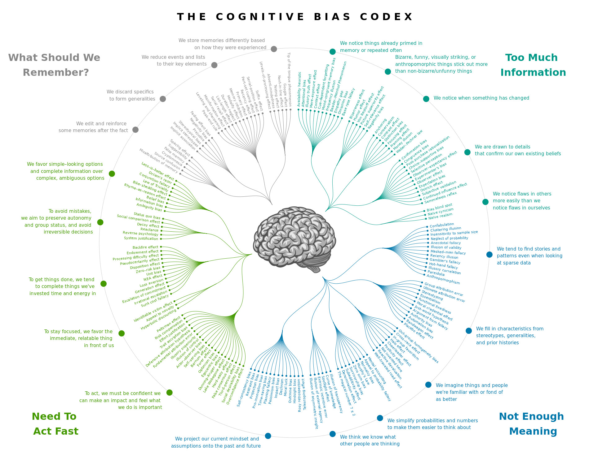

```{r setup, include=FALSE}
knitr::opts_chunk$set(echo = FALSE)
knitr::knit_hooks$set(mysize = function(before, options, envir) {
  if (before) {
    return(options$size)
  } else {
    return("\\normalsize")
  }
})
knitr::opts_chunk$set(mysize = TRUE, size = "\\tiny")
```

## Probabilidade e as sua Correntes de Interpretações

- tentativas de caracterizar quantitativamente a incerteza
- em muitas das culturas antigas, há esforços de sistematização do conceito,
  cálculo e uso de probabailidade
- em 1560, o polimata italiano Gerolamo Cardano começou a investigação matemática 
  de probabilidade a partir de problemas de jogos de azar
- em 1713, o matemático suíço Jakob Bernoulli apresentou a primeira tentativa de
  formalização matemática da probabilidade
- em 1933, a probabilidade teve sua formalização matemática finalmente resolvida
  pelo matemático russo Andrei Kolmogorov
- a Matemática por trás da Probabilidade é a mesma em todas as diferentes
  correntes filosóficas de interpretação
  - apenas sua interpretação ficou como tópico em aberto ao debate

## Principais Correntes Filosóficas de Interpretação

Divididas em dois grupos 

- interpretações objetivistas: 
  - probabilidades são referentes à realidade e independem de processos 
    cognitivo humanos
- interpretações epistemológicas: 
  - probabilidades são inerentes ao conhecimento e à crença humanos enquanto 
    processos cognitivos

## Interpretações objetivistas

- interpretação frequencista de probabilidade
  - Venn, Reichenbach, von Mises
  - probabilidade como limite da frequência relativa
  - problema com eventos não repetíveis
- interpretação lógica (ou evidencial) de probabilidade
  - Keynes, Jeffrey, Carnap
  - tentativa de desenvolver uma lógica indutiva, em complementariedade 
    à logica dedutiva tradicional
- interpretação propensitivista de probabilidade
  - Popper
  - probabilidade como *propensão* de um dispositivo físico produzir resultados 
    de certos tipos, mesmo que o evento nunca venha a se repetir

---

{width=40%}

Doctor Strange e Tony Stark em *Avengers Infinity Wars*: \linebreak
- Eu avancei no tempo e visitei 14.000.605 possíveis futuros. \linebreak
- Em quantos deles nós perdiamos? \linebreak
- Em todos exceto um.

Essa ***não é*** a interpretação usada em Estatística Bayesiana

## Interpretações epistemológicas

Interpretação clássica de probabilidade

- Bernoulli, Laplace e quase todos até o século 19
- não existe aleatoriedade no universo determinístico: 
  - não haveria nem incerteza e nem necessidade de medi-la através da 
    probabilidade 
    - se conseguíssemos medir tudo com precisão infinita

Interpretação subjetivista de probabilidade

- essa é a interpretação de probabilidade que fundamenta a Estatística Bayesiana
- de Finetti, Jeffrey
- aleatoriedade ser real ou não é irrelevante
- probabilidade é o *grau de crença* mantida por um *agente racional*
- mas quem é Bayes?!?  Veremos na próxima live

## Interpretação subjetivista de probabilidade

Como assim "probabilidade é o grau de crença mantida por um agente racional"?
Como se comporta esse "agente racional" em relação a essa crença?

Muito vago...  Vamos conceituar isso mais claramente!

Um agente racional:

- tem uma crença inicial a respeito da realidade que é coerente com o princípio 
  de indiferença entre apostas equivalentes (veremos a seguir), o que equivale 
  dizer que a crença inicial atende os axiomas de probabilidade (os quais também
  veremos a seguir) 
- atualiza suas crenças em face de novas evidências através de condicionamento
  Bayesiano (veremos na próxima *live*)

## Qual é a necessidade de um sistema racional de crenças?

Porque nós humanos somos ***sofríveis*** para avaliar incerteza/chance 
intuitivamente.

Não parece uma ideia ruim trabalhar com probabilidades subjetivistas já que somos 
vítimas dos mais diversos vieses cognitivos?

{width=40%}

Felizmente, é possível sim trabalhar de forma coerente com probabilidades 
subjetivistas.

## O Princípio de Indiferença entre Apostas Equivalentes

O agente racional não precisa ter consciência explícita do seu grau de crença
subjetivo inicial.  É possível *elicitar* esse grau de crença através do uso do 
*Princípio da Indiferença entre Apostas Equivalentes*

Para elicitar a probabilidade atribuída por ***você*** à chance de sair cara no 
lançamento de uma moeda, consideraremos uma aposta referente ao lançamento e três
outras apostas não relacionadas ao resultado do lançamento.  Em todos eles, *você*
está concorrendo a um prêmio de R\$ 1.000,00

- Aposta 1: você ganha o prêmio se sair cara
- Aposta 2: você ganha se for extraída uma bola azul de uma urna com 800 bolas 
  azuis e 200 bolas vermelhas
- Aposta 3: você ganha se for extraída uma bola azul de uma urna com 200 bolas 
  azuis e 800 bolas vermelhas
- Aposta 4: você ganha se for extraída uma bola azul de uma urna com 500 bolas 
  azuis e 500 bolas vermelhas

## O Princípio de Indiferença entre Apostas Equivalentes

- Se o agente racional prefere a Aposta 2 (800 azuis *vs* 200 vermelhas) à Aposta 1 
  (cara *vs* coroa), é sinal que as apostas não são equivalentes para ele.
- Se o agente racional prefere a Aposta 1 (cara *vs* coroa) à Aposta 3 (200 azuis 
  *vs* 800 vermelhas), é sinal que elas não são equivalentes para ele.
- Se tanto faz para o agente racional aceitar a Aposta 1 (cara *vs* coroa) ou a 
  Aposta 4 (500 azuis *vs* 500 vermelhas), *i.e.*, se o agente racional é 
  *indiferente* a elas, então:
  - as apostas são ditas *equivalentes* 
  - nesse caso, a razão entre o número de bolas azuis e vermelhas na Aposta 4 pode
    ser usada como a *sua* medida de confiança em que saia cara em um lançamento

## Indiferença entre Apostas Equivalentes e Coerência na Avaliação de Chance

E porquê uma garante a outra?

- um agente racional não concordaria voluntariamente com uma aposta que 
  garantidamente o fará perder dinheiro; esse tipo de aposta é chamada 
  *contrato de perda certa*
  - para cada par de apostas não equivalentes, é possível caracterizar a pior 
    aposta como a composição de duas apostas: uma aposta equivalente à melhor 
    aposta e uma aposta do tipo *perda certa*
  - no exemplo do lançamento da moeda, na comparação entre as Apostas 1 (cara 
    *vs* coroa) e 3 (200 azuis e 800 vermelhas), a Aposta 3 (pior) pode ser 
    obtida pela Aposta 1 e uma perda certa de ***PAREI AQUI***
    
    
***PAREI AQUI***
    
    
  - assim, o agente não pode aceitar a pior aposta
- se as crenças de um agente forem abertas a contratos de perda certa, então será 
  possível extrair todo o dinheiro desse agente, apenas aplicando iteradamente 
  contratos desse tipo
- assim, sistema de escolha de crenças é *coerente* se for fechado a contratos 
  de perda certa

O ponto chave entre probabilidade subjetivista e coerência é que um sistema de 
crenças subjetivas será coerente se e somente se ele atender aos axiomas de
Probabilidade, que veremos adiante.


# Breve Introdução à Teoria da Probabilidade

## Um pouco de linguajar: a axiomatização de Kolmogorov

- axiomatização == formalização matemática
- objetivo: apresentar para você, talvez pela primeira vez na sua vida se você 
  não tiver feito um bacharelado em Estatística, algo que nunca vão te apresentar 
  em outro lugar
  - "preciso realmente saber isso?"
    - se você quiser saber Bayesiana, sim
    - apesar de "não cair na prova", ter ouvido falar desses conceitos e fazer 
      alguma ideia do que eles querem dizer será bastante útil quando for preciso
      discutir modelagem mais seriamente e em situações mais complexas


## Estrutura conceitual e elementos da formalização

Conceitos

- espaço de probabilidade $(\Omega, \mathcal{F}, P)$
  - espaço amostral $\Omega$
  - sigma-álgebra $\mathcal{F}$
  - medida de probabilidade $P$
- os conceitos acima serão importantes à medida que são usados para definir os
  conceitos que mencionarei no slide seguintes, esses que fundamentam toda a 
  prática de Estatística Bayesiana


## Estrutura conceitual e elementos da formalização

Conceitos

- variável aleatória (v.a.) $X$
- função de distribuição acumulada de probabilidade $F_X$ 
- função de densidade de probabilidade $f_X$ de v.a.\ contínua
- função de massa de probabilidade $p_X$ de v.a.\ discreta
- valor esperado $\mathbb{E}(X)$ de v.a.\ $X$
- valor esperado $\mathbb{E}(g(X))$ de função $g$ de v.a.\ $X$
- variância $Var(X)$ de v.a.\ $X$
- variância $Var(g(X))$ de função $g$ de v.a.\ $X$


## Estrutura conceitual e elementos da formalização

Conceitos

- vetor aleatório ou conjunto de variáveis aleatórias
  $X=(X_1, X_2, \ldots, X_n)$
- função de distribuição acumulada conjunta $F_X$ 
- função de densidade conjunta $f_X$ de v.a.s contínuas
- função de massa conjunta $p_X$ de v.a.s discretas
- valor esperado $\mathbb{E}(X)$ do vetor $X$
- valor esperado $\mathbb{E}(g(X))$ de função $g$ do vetor $X$
- covariância $Covar(X_1, X_2)$ de v.a.s contínuas
- covariância $Covar(X_1, X_2)$ de v.a.s discretas


## Espaço de probabilidade $(\Omega, \mathcal{F}, P)$

O trio $(\Omega, \mathcal{F}, P)$

- $\Omega$ é chamado espaço amostral
- $\mathcal{F}$ é chamada sigma-álgebra
- $P$ é chamada a medida de probabilidade


## Espaço de probabilidade $(\Omega, \mathcal{F}, P)$

Espaço amostral $\Omega$:

- conjuntos de elementos ou valores individuais observaveis (chamados
  *pontos amostrais* $\omega$)
- exemplos
  - espaços numéricos: 
    - $\{1, 2, 3, 4, 5, 6\}$
    - $\mathbb{R}$
    - $\mathbb{R}^n$
  - espaços abstratos: 
    - polígonos
    - pessoas
    - sentimentos
    - modelos estatísticos $\longrightarrow$ esse exemplo é interessante


## Espaço de probabilidade $(\Omega, \mathcal{F}, P)$

- um *evento* $E$ é um subconjunto de $\Omega$, um conjunto de pontos amostrais
- o conjunto de todos os eventos $E$ possíveis de $\Omega$ é o *conjunto-potência*
  $2^\Omega$
  - por diversas razões técnicas matemáticas, não é possível medir probabilidade 
    de forma coerente para a totalidade dos eventos $E\in 2^\Omega$ para $\Omega$
    arbitrários
    - só é possível para $\Omega$ finito ou infinito enumerável
    - para $\Omega$ infinito não-enumerável, é possível construir uma multidão de 
      eventos $E$ fractais para os quais seja impossível criar valores coerentes 
      de probabilidade
  - então é preciso uma classe $\mathcal{F}$ mais restrita do que $2^\Omega$, na 
    qual esses tipos de problemas não ocorram e na qual seja possível medir
    probabilidade de forma coerente para a totalidade dos eventos $\longrightarrow$
    sigma-álgebra


## Espaço de probabilidade $(\Omega, \mathcal{F}, P)$

Sigma-álgebra $\mathcal{F}$

- conjunto $\mathcal{F}$ dos *eventos* $E\in 2^\Omega$ (subconjuntos de $\Omega$)
  cuja probabilidade se queira medir: $\mathcal{F}\subset 2^\Omega$
  - podem ser conjuntos unitários, só com os pontos amostrais individuais,
  - mas também podem ser blocos ou faixas inteiras de pontos amostrais
- precisa conter $\Omega$: $\Omega\in\mathcal{F}$
- precisa ser fechado em relação a
    - união enumerável: $\bigcup_{i=1}^\infty E_i\in\mathcal{F}$ 
      para todo $E_1,E_2,E_3,...\in\mathcal{F}$
    - complementação: $E^c\in\mathcal{F}$ para todo $E\in\mathcal{F}$


## Espaço de probabilidade $(\Omega, \mathcal{F}, P)$

Sigma-álgebra $\mathcal{F}$

- sigma-álgebra que mencionada adiante: a sigma-álgebra $\mathcal{B}(\mathbb{R})$ 
  dos conjuntos borelianos $B$ de $\mathbb{R}$
  - precisa conter todos os conjuntos abertos dos reais $\mathbb{R}$
  - precisa ser fechada em relação à 
    - união enumerável
    - interseção enumerável
    - diferença de conjuntos
  - só com isso, já tem todos os conjuntos numéricos $B$ que interessam para 
    cálculo de probabilidade que veremos nos próximos slides

## Espaço de probabilidade $(\Omega, \mathcal{F}, P)$

Medida de probabilidade $P$

- é uma função $P:\mathcal{F} \to \mathbb{R}$ que leva os eventos $E$ a valores 
  no intervalo $[0, 1]$
- é uma função não-negativa: $P(E)\ge 0$
- é uma função normalizada: $P(\Omega) = 1$
- é uma função enumeravelmente aditiva: 
  $P(\bigcup_{i=1}^\infty E_i) = \sum_{i=1}^\infty P(E_i)$
  para todo $E_i\in\mathcal{F}$, $i=1,2,3,...$ disjuntos aos pares 
  $E_i\cap E_j=\emptyset$, $i\ne j$
- várias propriedade desejaveis da medida de probabilidade são
  consequências dessa propriedade
  - monotonicidade: $P(A)\le P(B)$ se $A\subset B$
  - complemento: $P(E^C)=1-P(E)$
  - união não exclusiva: $P(A\cup B)=P(A)+P(B)-P(A\cap B)$ 
    para $A,B\in\mathcal{F}$

## Variável aleatória $X$

Em Estatística Bayesiana, tudo com que trabalharemos serão variáveis aleatórias.

Para início de conversa, o termo *variável aleatória* é enganador, pois uma 
"variável aleatória" não é, em princípio, nem variável e nem aleatória.

Tecnicamente, uma variável aleatória $X$ é uma função $X:\Omega\to\mathbb{R}$ 
que leva cada elemento $\omega$ do espaço amostral $\Omega$ em um valor 
quantitativo unidimensional em $\mathbb{R}$ e que é mensurável em relação a uma 
sigma-álgebra $\mathcal{F}$ 

***QUAL ERA A CONEXÃO ENTRE A SIGMA-ÁLGEBRA E A V.A.\ MESMO?***

- $X:\Omega\to\mathbb{R}$
  - pessoas $to$ estatura
  - pessoas $to$ peso
  
## Variável aleatória $X$

Mensurabilidade

- *imagem inversa* ou *pré-imagem* $X^{-1}$ da função $X:\Omega\to\mathbb{R}$ 
  é uma função $X^{-1}:2^\mathbb{R}\to 2^\Omega$ que leva conjuntos dos reais 
  $R\subset\mathbb{R}$ em eventos $E\subset\Omega$ definida
  por $X^{-1}(R):=\{\omega\in\Omega: X(\omega)\in R\}$

- $X$ é *mensurável* em relação à sigma-álgebra $\mathcal{F}$ se a *imagem inversa*
  de todos os borelianos estiver em $\mathcal{F}$: $X^{-1}(B)\in\mathcal{F}$ para
  todo $B\in\mathcal{B}(\mathbb{R})$

***PAREI AQUI***

## Vetor aleatório $X = (X_1, X_2,\ldots, X_n)$

Função $X:\Omega\to\mathbb{R}^n$ que leva cada elemento $\omega$ do espaço 
amostral $\Omega$ em um valor quantitativo multidimensional e que mensurável em 
relação a $mathcal{F}$ 

- $X:\Omega\to\mathbb{R}^n$
  - pessoas $to$ (estatura, peso)
- mensurabilidade
  - ***AQUI***
- só podemos falar do relacionamento entre duas variáveis $X_1$ e $X_2$ 
  (associação, correlação etc.) em um mesmo contexto se elas forem parte de 
um mesmo vetor aleatório $X=(X_1, X_2)$

## **AINDA FALTA: somente conceituar $to$ o cálculo está em alguma seção adiante**

- função de distribuição (acumulada) (de probabilidade) $F_X$ de uma variável
  aleatória $X$
- função de densidade (de probabilidade) $f_X$ de uma variável aleatória $X$ 
  contínua
- função de massa (de probabilidade) $p_X$ de uma variável aleatória $X$ distreta
- expectância ou valor esperado $\mathbb{E}(X)$ de uma variável aleatória $X$
- expectância ou valor esperado $\mathbb{E}(g(X))$ de uma função $g$ de variável
  aleatória $X$
- variância $Var(X)$ de uma variável aleatória $X$
- variância $Var(g(X))$ de uma função $g$ de uma variável aleatória $X$


# Cálculo de Probabilidade

## Mas como calculamos probabilidades em si?

Precisamos encontrar pressupostos que possam ser assumidos no contexto

  - TODA probabilidade é condicional nas premissas que são assumidas; 
  - se as premissas forem falsas, não é a probabilidade que está errada: ela
    simplesmente não é a probabilidade que se aplica àquele caso

Exemplos
- simetria e equiprobabilidade
  - arremesso de moeda cilindrica em superficie almofadada
- E quando não há simetria? 
  - arremesso de moeda chanfrada (tronco de cone) em superfície rígida (vai
    quicar)
  - arremesso de moeda imantada em campo magnético com intensidade em função 
    de um controle

## Regras de operações com probabilidades

- com eventos
  - regra da partição: $P(A) = P(A\cap B) + P(A\cap B^C)$
  - regra do complemento: $P(A^C) = 1 - P(A)$
  - regra da inclusão-exclusão: 
    $P(A\cup B\cup C) = P(A) + P(B) + P(C) - P(A\cap B) - P(A\cap C) - P(B\cap C) 
      + P(A\cap B\cap C)$
  - ???
- com variáveis aleatórias
    - ???
- ???

### **AINDA FALTA: como calcular** 

- função de distribuição (acumulada) (de probabilidade) $F_X$ de uma variável
  aleatória $X$
  - $F_X(x) := P(X \le x) = P(X \in (-\infty, x]) = P(X^{-1}((-\infty, x]))$

- função de densidade (de probabilidade) $f_X$ de uma variável aleatória $X$ 
  contínua
  - $f_X(x) := F'_X(x)$
- função de massa (de probabilidade) $p_X$ de uma variável aleatória $X$ distreta
  - $p_X(x) := P(X = x)$
- expectância ou valor esperado $\mathbb{E}(X)$ de uma variável aleatória $X$
  - caso contínuo: 
    - $\mathbb{E}(X):=\int_\mathbb{R} x\ f_X(x)\ dx$
  - caso discreto: 
    - $\mathbb{E}(X):=\sum_{supp(p_X)} x\ p_X(x)\ dx$
    - onde $supp(p_X)$ é o *suporte* de $p_X$, o conjunto de valores de 
      $\mathbb{R}$ que ocorrem com probabilidade não nula: 
      $supp(p_X):=\{x\in\mathbb{R}:p_X(x) > 0\}$ 
- expectância ou valor esperado $\mathbb{E}(g(X))$ de uma função $g$ de variável
  aleatória $X$
  - caso contínuo: $\mathbb{E}(g(X)):=\int_\mathbb{R} g(x)\ f_X(x)\ dx$
  - caso discreto: $\mathbb{E}(g(X)):=\sum_{supp(p_X)} g(x)\ p_X(x)\ dx$
- variância $Var(X)$ de uma variável aleatória $X$
- variância $Var(g(X))$ de uma função $g$ de uma variável aleatória $X$


# Modelos e distribuições de probabilidade

## Modelos Discretos de Distribuição de Probabilidade

- uniforme discreta
- Bernoulli, binomial, binomial negativa
- geométrica e hipergeométrica
- Poisson
- Zipf

## Modelos Contínuos de Distribuição de Probabilidade

- uniforme, beta, 
- exponencial, gama
- normal, qui quadrado, F de Snedecor, t de Student, log-normal
- logistica


